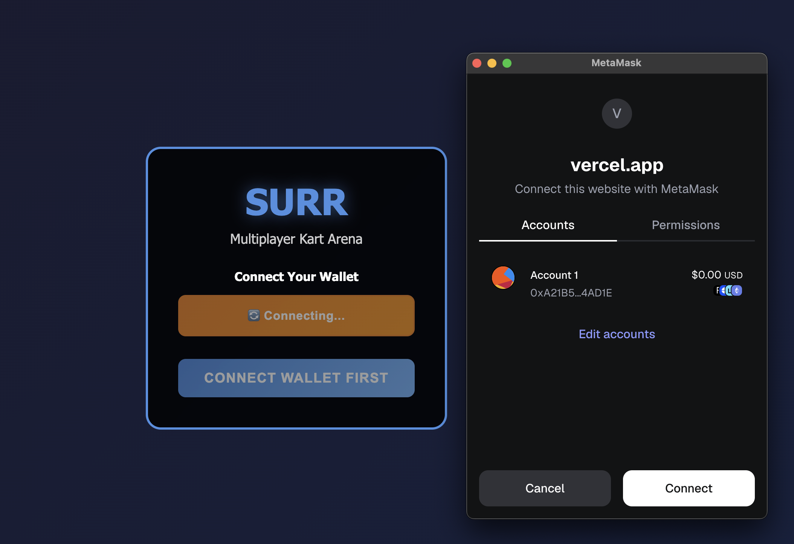
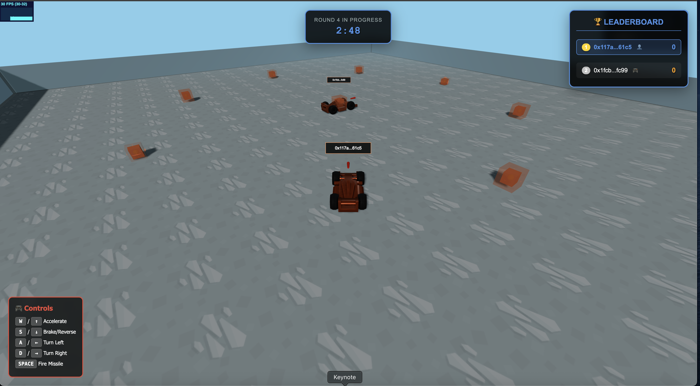
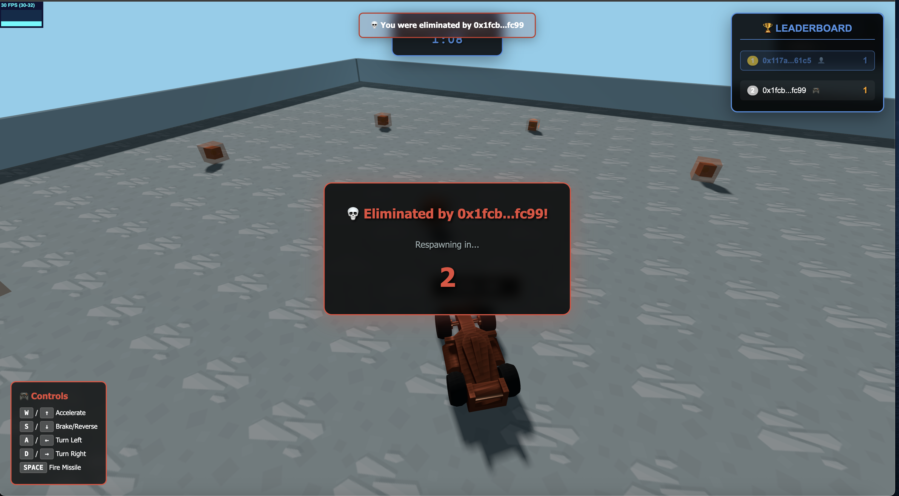

# Surr - Multiplayer Kart Arena Game


**Surr** is a fast-paced, Web3-enabled multiplayer arena kart game where players compete in real-time battles, collect weapon pickups, eliminate opponents, and earn cryptocurrency rewards. It is powered by Flow Blockchain. Built with modern web technologies and blockchain integration, Surr combines traditional gaming excitement with decentralized rewards.

**FlowScan Contract:**  
SURR Token - [https://evm-testnet.flowscan.io/token/0xDE8c68317AB8699A37E208Ef6EE7Ef8E173707E1](https://evm-testnet.flowscan.io/token/0xDE8c68317AB8699A37E208Ef6EE7Ef8E173707E1)
Tournament Contract - [https://evm-testnet.flowscan.io/address/0x25008901Cfd954CeFD531fE5bfaae1F11E1f3F1c](https://evm-testnet.flowscan.io/address/0x25008901Cfd954CeFD531fE5bfaae1F11E1f3F1c)

## 🎮 Game Overview



**Core Concept**: Drive, Shoot, Earn
- **Genre**: Multiplayer Kart Arena Combat
- **Platform**: Web Browser (PC)
- **Players**: Up to 6 concurrent players
- **Session**: Continuous 3-minute rounds with join-anytime gameplay
- **Rewards**: Earn SUR tokens for each elimination



## 🚀 Quick Start

### Prerequisites
- **Node.js** v20 or higher
- **MetaMask** browser extension
- **Git** for cloning the repository

### Installation

1. **Clone the repository**
   ```bash
   git clone <repository-url>
   cd Surr
   ```

2. **Install Client Dependencies**
   ```bash
   cd client
   npm install
   ```

3. **Install Server Dependencies**
   ```bash
   cd ../server
   npm install
   ```

4. **Install Smart Contract Dependencies**
   ```bash
   cd ../contracts
   npm install
   ```

### Running the Game

1. **Start the Server**
   ```bash
   cd server
   npm run dev
   ```
   Server runs on `http://localhost:3000`

2. **Start the Client**
   ```bash
   cd client
   npm run dev
   ```
   Game runs on `http://localhost:5173`

3. **Connect Your Wallet**
   - Install MetaMask if you haven't already
   - Click "Connect Wallet" on the welcome screen
   - Approve the connection request
   - Join the game and start playing!

## 🎯 How to Play

### Controls
- **W** or **↑**: Accelerate
- **S** or **↓**: Brake/Reverse
- **A** or **←**: Turn Left
- **D** or **→**: Turn Right
- **Spacebar**: Fire equipped weapon

### Gameplay Loop
1. **Connect Wallet**: Use MetaMask to authenticate
2. **Join Arena**: Enter your name and join the ongoing match
3. **Collect Weapons**: Drive over weapon pickups scattered around the arena
4. **Eliminate Opponents**: Use missiles to eliminate other players
5. **Earn Rewards**: Get 1 point per elimination and earn SUR tokens
6. **Respawn**: Eliminated players respawn after 5 seconds
7. **Round Reset**: Every 3 minutes, scores reset and rewards are distributed



## 🎮 Game Rules & Mechanics

### Combat System
- **Weapons**: Missile pickups spawn at 9 predefined locations
- **One Shot, One Kill**: A single missile hit eliminates an opponent
- **Instant Collection**: Drive over weapon boxes to collect missiles
- **No Cooldowns**: Fire immediately when you have a weapon
- **Client Authority**: Shooter's client handles missile physics and hit detection

### Scoring & Rewards
- **1 Point** per elimination
- **Real-time Leaderboard** shows current standings
- **SUR Token Rewards** distributed at the end of each 3-minute round
- **Lifetime Stats** tracked on-chain via smart contracts

### Arena Features
- **100x100 Unit Arena** with visible boundary walls
- **9 Weapon Pickup Locations** evenly distributed
- **15-Second Respawn Timer** for weapon boxes
- **Random Respawn Points** for eliminated players

## 🏆 Reward System

### SUR Token (ERC20)
- **Symbol**: SUR
- **Purpose**: In-game currency and rewards
- **Earning Method**: Kill-to-earn mechanics
- **Distribution**: Automatic payout after each round

### Token Economics
- **10 SUR tokens** per elimination (example rate)
- **Treasury-controlled minting** for sustainable rewards
- **On-chain lifetime stats** for player achievements
- **Future tournament pools** with token entry fees

### Planned Features
- **Tournament Mode**: Pool tokens for larger prizes
- **Car NFTs**: Unique vehicle collectibles
- **Marketplace**: Trade cars and items
- **Staking Rewards**: Additional earning opportunities

## 🛠 Technology Stack

### Frontend
- **Three.js**: 3D rendering and graphics
- **Cannon-es**: Physics engine for vehicle dynamics
- **JavaScript (ES6+)**: Game logic and client-side processing
- **Vite**: Build tool and development server
- **Socket.IO Client**: Real-time multiplayer communication
- **Web3.js**: Blockchain interaction

### Backend
- **Node.js v20**: Server runtime
- **Express**: Web framework
- **Socket.IO**: Real-time networking
- **Web3.js**: Smart contract integration

### Blockchain
- **Solidity**: Smart contract development
- **Hardhat**: Development environment
- **OpenZeppelin**: Secure contract libraries
- **MetaMask**: Wallet integration

### Smart Contracts
- **SurrToken.sol**: ERC20 reward token
- **LifetimeKills.sol**: On-chain player statistics
- **Tournament.sol**: Prize pool management (planned)
- **SurrCars.sol**: NFT vehicles (planned)

## 🏗 Architecture

### Client-Server Model
- **Client-side**: Rendering, input handling, physics simulation
- **Server-side**: Game state management, player synchronization
- **Hybrid Authority**: Client handles missiles, server manages state

### Networking Features
- **Optimized Position Broadcasting**: 50ms throttling with change detection
- **Client-side Interpolation**: Smooth remote player movement
- **20Hz Server Tick Rate**: Consistent game state updates
- **Connection Management**: Real-time status tracking

### Function-Based Design
- **No Classes**: All modules export functions for simplicity
- **Module-level State**: Clean state management
- **Direct Imports**: Import only needed functions
- **Performance Optimized**: Minimal overhead architecture

## 📁 Project Structure

```
Surr/
├── client/                 # Frontend game client
│   ├── src/
│   │   ├── game/          # Core game systems
│   │   ├── ui/            # User interface components
│   │   ├── network/       # Socket.IO client
│   │   ├── web3/          # Blockchain integration
│   │   └── utils/         # Helper utilities
│   └── public/assets/     # 3D models and textures
├── server/                # Backend game server
│   └── src/
│       ├── game/          # Game state management
│       ├── network/       # Socket.IO server
│       └── web3/          # Smart contract interaction
├── contracts/             # Smart contracts
│   ├── contracts/         # Solidity files
│   ├── ignition/          # Deployment scripts
│   └── test/              # Contract tests
└── memory-bank/           # Documentation and design docs
```

## 🚀 Development & Contributing

### Development Commands

**Client Development:**
```bash
cd client
npm run dev     # Start development server
npm run build   # Build for production
npm run preview # Preview production build
```

**Server Development:**
```bash
cd server
npm start       # Start production server
npm run dev     # Start with auto-reload
npm test        # Run tests
```

**Smart Contracts:**
```bash
cd contracts
npx hardhat compile    # Compile contracts
npx hardhat test       # Run contract tests
npx hardhat node      # Start local blockchain
```

### Architecture Guidelines
- **Function-based Design**: Prefer functions over classes
- **Modular Structure**: Keep files under 200-300 lines
- **Clear Documentation**: Comment code and update docs
- **Performance First**: Optimize for real-time gameplay

## 🔐 Security & Web3

### Wallet Security
- **MetaMask Required**: Secure wallet integration
- **No Private Key Storage**: Client-side wallet management
- **Connection State Management**: Automatic reconnection handling

### Smart Contract Security
- **OpenZeppelin Libraries**: Battle-tested contract components
- **Access Control**: Role-based permissions
- **Audit-Ready**: Clean, documented contract code

## 🗺 Roadmap

### Phase 1: Core Game ✅
- Multiplayer kart arena
- Real-time combat
- Weapon pickup system
- Leaderboard

### Phase 2: Web3 Integration ✅
- MetaMask wallet connection
- SUR token deployment
- Kill-to-earn rewards
- 3-minute round system

### Phase 3: Advanced Features 🚧
- Lifetime kills tracking
- On-chain statistics
- Tournament system
- Prize pools

### Phase 4: NFT Integration 📋
- Car NFT collection
- Unique vehicle models
- Marketplace integration
- Rarity system

### Phase 5: Ecosystem Expansion 📋
- Mobile compatibility
- Additional game modes
- DAO governance
- Community features

## 📄 License

MIT License - see LICENSE file for details

## 🤝 Community & Support

- **GitHub Issues**: Report bugs and request features
- **Documentation**: Check `/memory-bank/` for detailed docs
- **Architecture Guide**: See `memory-bank/architecture.md`
- **Game Design**: Review `memory-bank/game-design-document.md`

---

**Ready to dominate the arena? Connect your wallet and start earning!** 🏆🚗💰